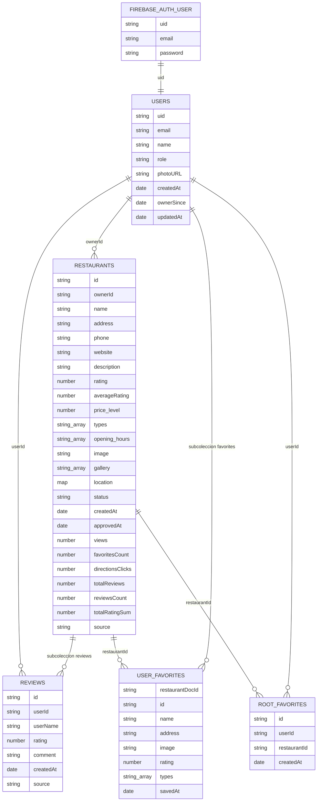
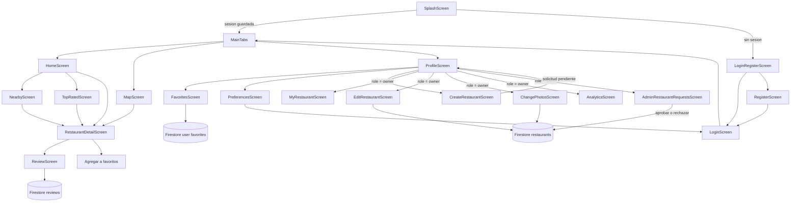
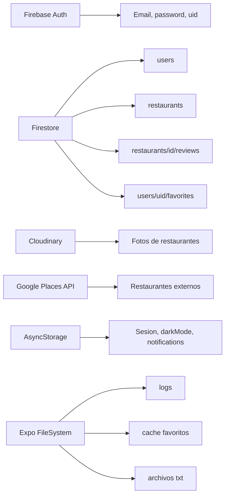

# Diagramas del proyecto LocalEats

Documento editable con diagramas basados directamente en la estructura actual del proyecto LocalEats.

## Tecnologias de datos detectadas

LocalEats utiliza principalmente Firebase y algunos servicios externos:

- Firestore: base de datos principal de la aplicacion.
- Firebase Auth: autenticacion de usuarios.
- Firebase Storage: esta inicializado en `firebaseConfig.js`, pero no se observa uso directo en los flujos actuales.
- Cloudinary: almacenamiento real de fotos al registrar restaurantes.
- Google Places API: fuente externa de restaurantes cercanos.
- AsyncStorage: almacenamiento local de sesion y preferencias.
- Expo FileSystem: logs, cache de favoritos y exportaciones `.txt`.

## Colecciones y almacenamiento

| Fuente | Tipo | Uso en LocalEats |
| --- | --- | --- |
| Firebase Auth | Autenticacion | Login, registro y sesion de usuarios |
| Firestore `users` | Base de datos | Perfil, rol, email, foto y datos de propietario |
| Firestore `restaurants` | Base de datos | Restaurantes registrados por usuarios |
| Firestore `restaurants/{id}/reviews` | Base de datos | Resenas hechas desde la app |
| Firestore `users/{uid}/favorites` | Base de datos | Favoritos del usuario |
| Firestore `favorites` | Base de datos | Coleccion raiz detectada en `FavoritesService.js` |
| Cloudinary | Almacenamiento externo | Fotos de restaurantes |
| Google Places API | API externa | Restaurantes cercanos y datos de Google |
| AsyncStorage | Local | Usuario recordado, modo oscuro y notificaciones |
| Expo FileSystem | Local | Logs, cache de favoritos y fichas exportadas |

## Diagrama entidad-relacion

### Notas del diagrama entidad-relacion

- `users` es una coleccion de Firestore.
- `restaurants` es una coleccion de Firestore.
- `reviews` es una subcoleccion dentro de cada restaurante: `restaurants/{restaurantId}/reviews`.
- `favorites` se usa principalmente como subcoleccion dentro de cada usuario: `users/{uid}/favorites`.
- Tambien existe una coleccion raiz `favorites` en `Services/FavoritesService.js`; convendria unificar el modelo para evitar duplicidad.

## Diagrama de navegacion

### Observacion de navegacion

En `LoginScreen.js` existe una navegacion hacia `RecuperarContraseña`, pero esa pantalla no esta registrada en `App.js`. Si el usuario pulsa esa opcion, puede fallar la navegacion.

## Diagrama de clases y estructura

```mermaid
classDiagram
    class App {
        +NavigationContainer
        +StackNavigator
        +initFileSystem()
    }

    class BottomTabs {
        +Home
        +Map
        +Profile
    }

    class FirebaseConfig {
        +auth
        +db
        +storage
    }

    class HomeScreen {
        +loadRestaurants()
        +getApprovedRestaurantsFromFirestore()
        +filterRestaurants()
    }

    class MapScreen {
        +loadMapData()
        +startNavigation()
        +getRestaurantCoordinates()
    }

    class RestaurantDetailScreen {
        +refreshRestaurantData()
        +addView()
        +checkFavorite()
        +addToFavorites()
    }

    class ReviewScreen {
        +sendReview()
        +listenReviews()
    }

    class ProfileScreen {
        +loadUser()
        +loadOwnerStats()
        +pickProfileImage()
        +handleLogout()
    }

    class CreateRestaurantScreen {
        +uploadImages()
        +saveRestaurant()
        +validateStep()
    }

    class AdminRestaurantRequestsScreen {
        +loadPendingRestaurants()
        +approveRestaurant()
        +rejectRestaurant()
    }

    class EditRestaurantScreen {
        +loadRestaurant()
        +saveChanges()
        +deleteRestaurant()
    }

    class ChangePhotosScreen {
        +loadRestaurant()
        +savePhotos()
    }

    class AnalyticsScreen {
        +loadAnalytics()
    }

    class FavoritesScreen {
        +loadFavorites()
        +removeFavorite()
    }

    class PlacesApi {
        +getNearbyRestaurants(lat, lng)
    }

    class FirebaseRestaurantsApi {
        +getApprovedRestaurants()
    }

    class FavoritesService {
        +addFavorite(userId, restaurantId)
        +removeFavorite(userId, restaurantId)
    }

    class FileManager {
        +initFileSystem()
        +cacheFavorites()
        +readCachedFavorites()
        +exportRestaurantProfileTxt()
        +logInfo()
        +logError()
    }

    class Cloudinary {
        +uploadRestaurantImages()
    }

    App --> BottomTabs
    App --> FirebaseConfig
    BottomTabs --> HomeScreen
    BottomTabs --> MapScreen
    BottomTabs --> ProfileScreen

    HomeScreen --> PlacesApi
    HomeScreen --> FirebaseConfig
    MapScreen --> PlacesApi
    MapScreen --> FirebaseRestaurantsApi
    MapScreen --> FirebaseConfig

    RestaurantDetailScreen --> FirebaseConfig
    ReviewScreen --> FirebaseConfig
    ProfileScreen --> FirebaseConfig
    CreateRestaurantScreen --> FirebaseConfig
    CreateRestaurantScreen --> Cloudinary
    AdminRestaurantRequestsScreen --> FirebaseConfig
    EditRestaurantScreen --> FirebaseConfig
    ChangePhotosScreen --> FirebaseConfig
    AnalyticsScreen --> FirebaseConfig
    FavoritesScreen --> FirebaseConfig
    FavoritesScreen --> FileManager
```

## Diagrama de fuentes de datos

## Archivos revisados

- `firebaseConfig.js`
- `App.js`
- `navigation/BottomTabs.js`
- `Screens/CreateRestaurantScreen.js`
- `Screens/RestaurantDetailScreen.js`
- `Screens/ReviewScreen.js`
- `Screens/FavoritesScreen.js`
- `Screens/ProfileScreen.js`
- `Screens/AdminRestaurantRequestsScreen.js`
- `Screens/EditRestaurantScreen.js`
- `Screens/ChangePhotosScreen.js`
- `Screens/AnalyticsScreen.js`
- `Screens/MapScreen.js`
- `Services/PlacesApi.js`
- `Services/FirebaseRestaurantsApi.js`
- `Services/FavoritesService.js`
- `Logs/FileManager.js`
